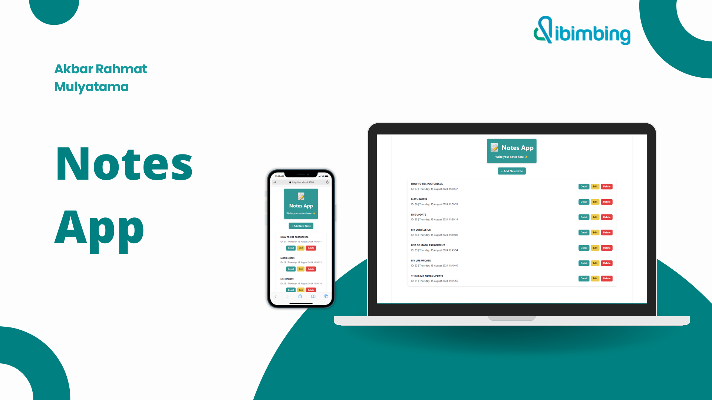
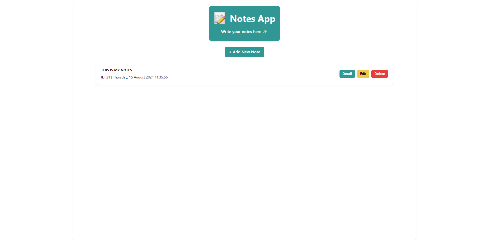
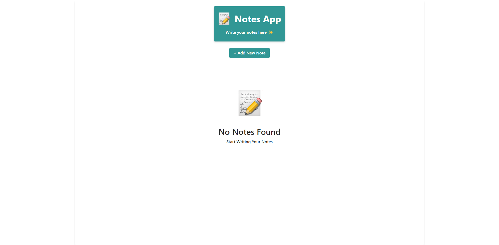
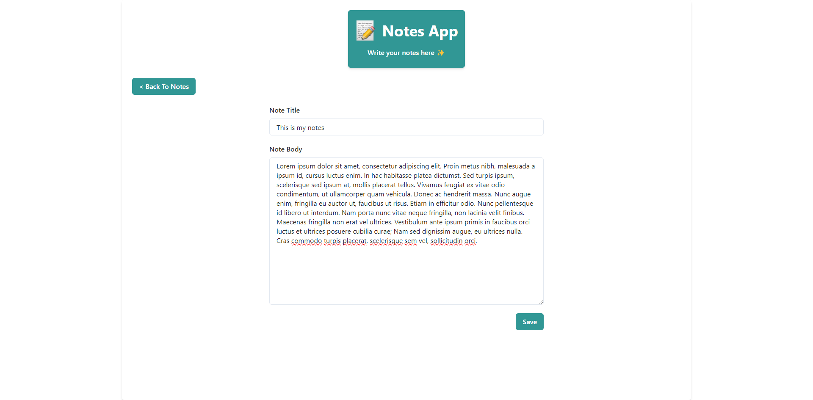
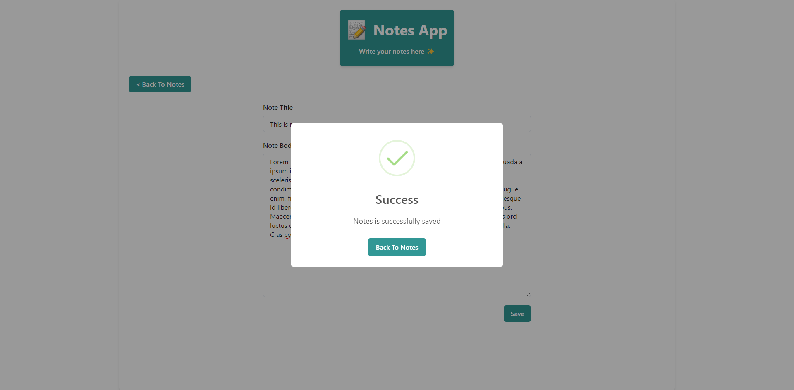
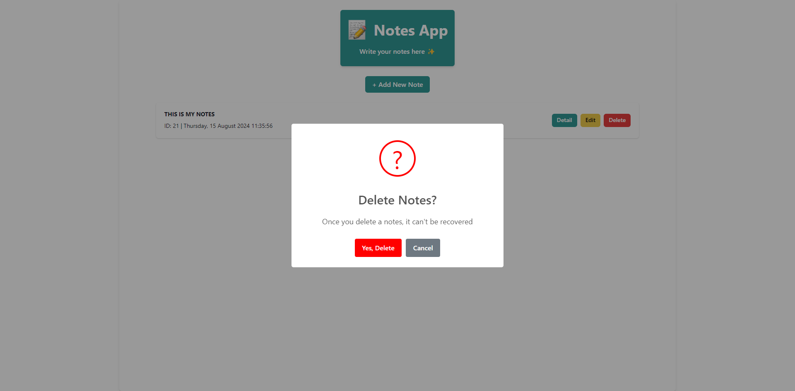
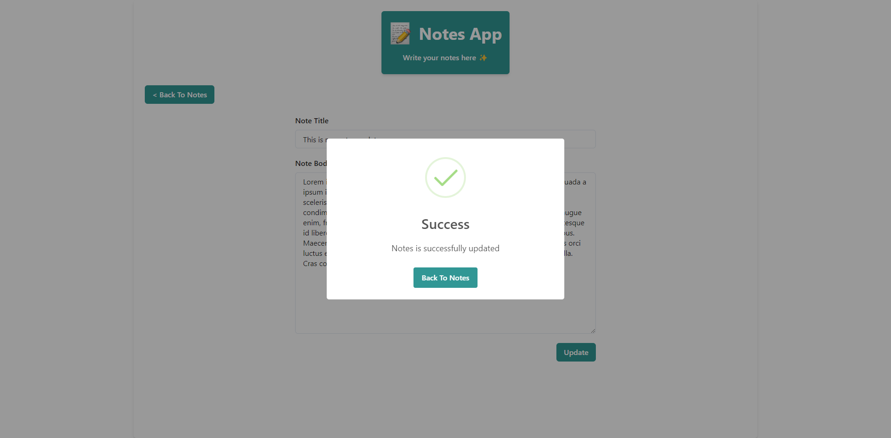

## Study Case Fullstack Engineer Dibimbing.id MSIB 7

     

A note-taking application designed to capture and organize your thoughts. Built with Next.js and powered by a PostgreSQL database.

### Demo

Demo Website : [Click Here](https://dibimbing-studycase-noteapp-qiv9.vercel.app/)

### API Docs

Postman Documentation : [Click Here](https://documenter.getpostman.com/view/22728093/2sA3s7hnv1)

### Features

- Mobile Responsive
- Seamless Routing
- Create New Notes
- Detail Notes
- Edit Notes
- Delete Notes

### Tech & Tools Used

- Next.js
- PostgreSQL
- Prisma
- Chakra UI
- Toastify
- SweetAlert2
- Dayjs

### Preview

     

    Main Page, With Data 

     

    Main Page, Without Data (Empty State) 

     

    Add Note Page

     

    Note Successfully Created

     

    Delete Note Confirmation

     

    Edit note 

     

    Note Successfully Updated 

